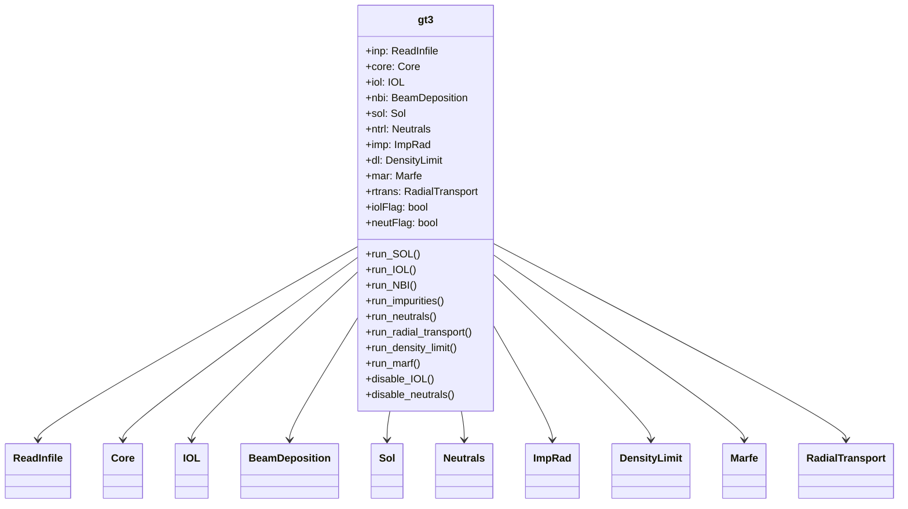
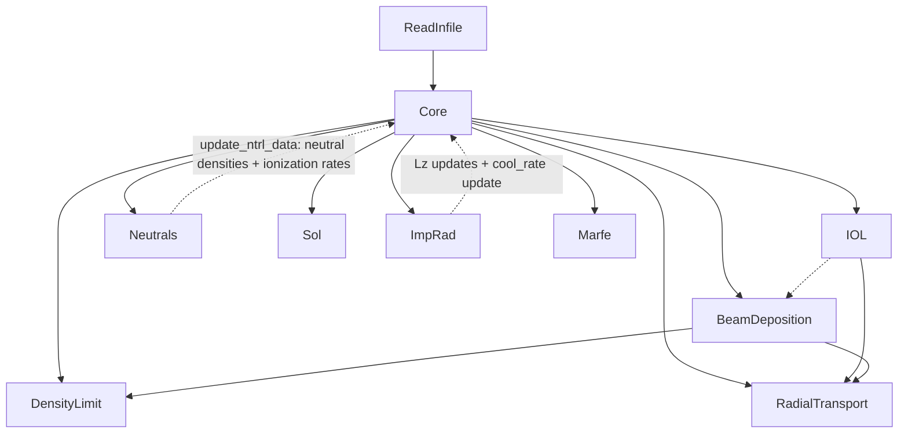
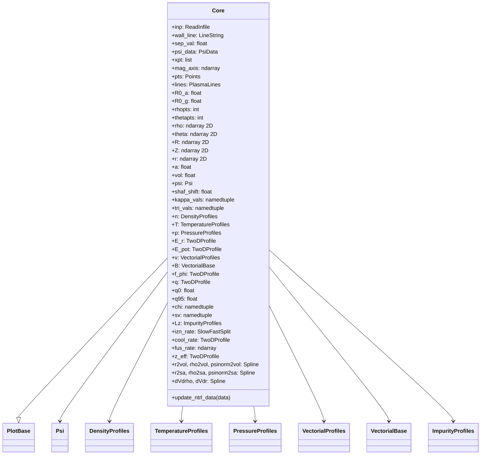
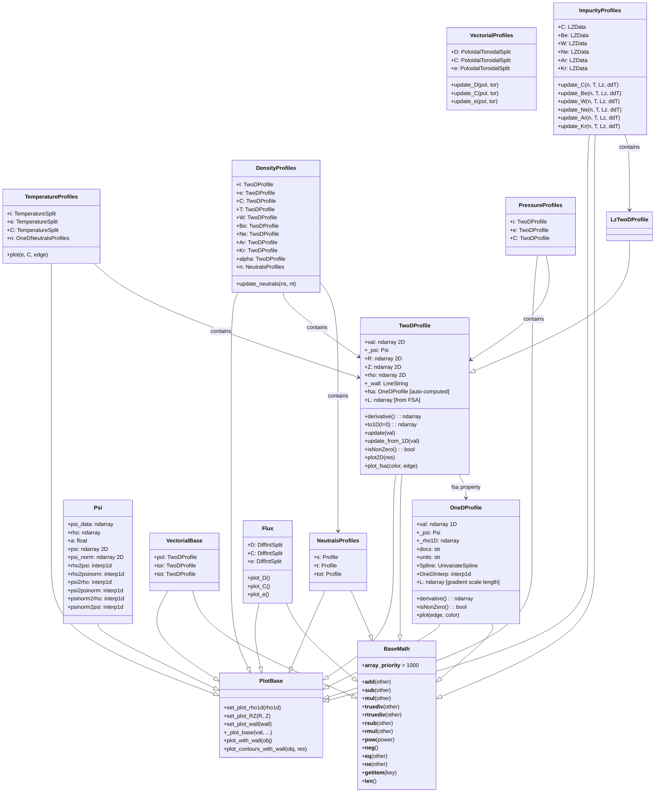
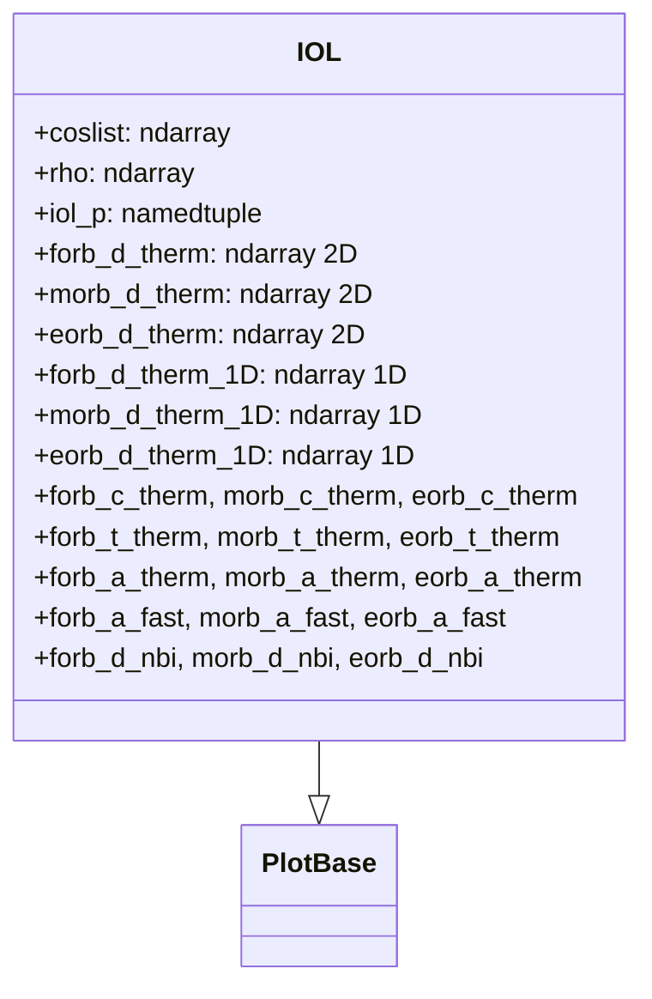
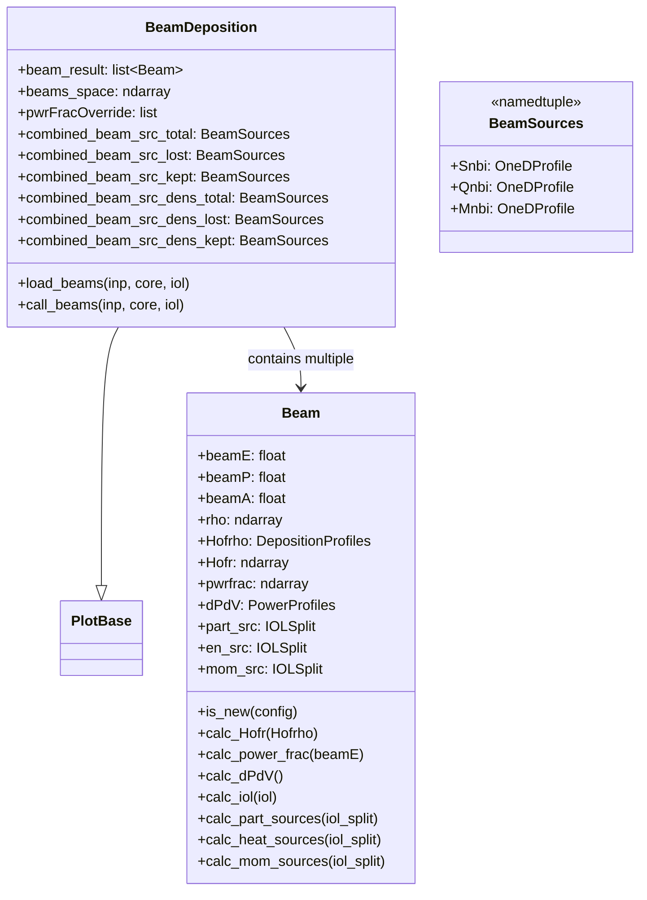
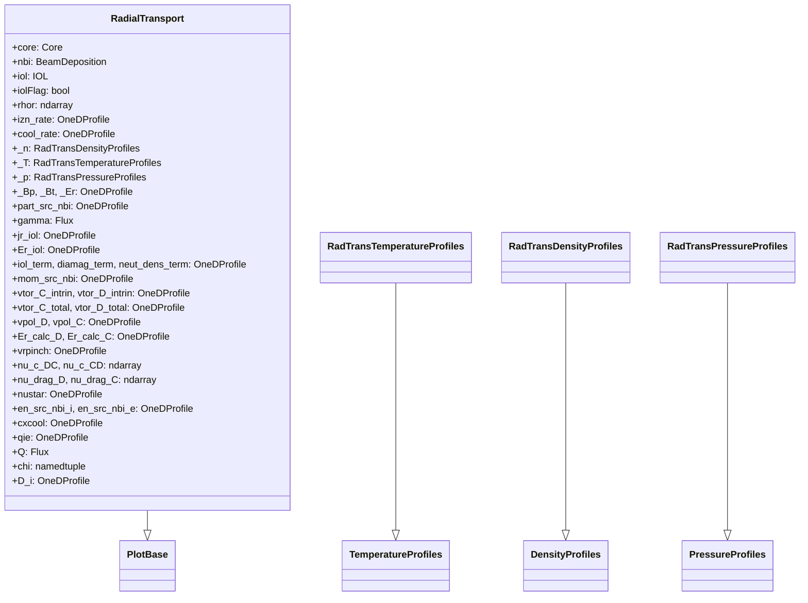
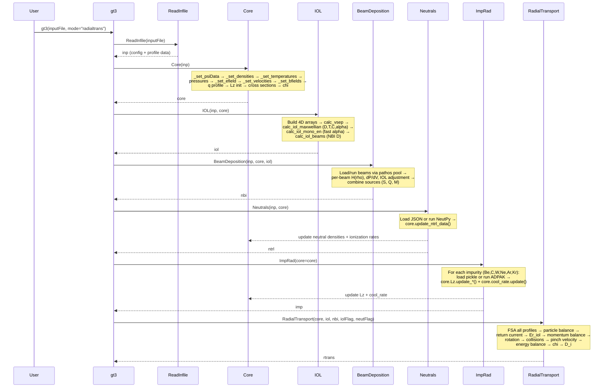

# Low-level architecture: GT3 codebase

## System shape

- **Language and packaging**: Python 3.8+ ([setup.py](../setup.py)); distributed as setuptools package `GT3` with `find_packages()`.
- **Execution model**: In-process scientific Python. Dependencies declared in `setup.py`: NumPy, SciPy, Matplotlib, Shapely, `contours` (flux-surface contour generation), `pathos` / `multiprocess` (beam deposition parallelism), `PyYAML` (beam config files), `deprecation` (deprecation decorators), `pandas`, `texttable`, `enum34`. No long-running server; users instantiate [`GT3.gt3`](../GT3/gt3.py) or import submodules directly.
- **External optional runtime**: [NeutPy](https://github.com/gt-frc/neutpy) (optional) plus the **Triangle** CLI for meshing when neutrals are computed from scratch ([GT3/Neutrals/neutrals.py](../GT3/Neutrals/neutrals.py)).

---

## Top-level entry and composition root

The facade class **`gt3`** in [`GT3/gt3.py`](../GT3/gt3.py) is the composition root:

1. Builds **`ReadInfile`** ([`GT3/ReadInFIle/read_in_file.py`](../GT3/ReadInFIle/read_in_file.py)) from a config path **or** accepts a pre-built `preparedInput` object (used by [`GT3/TestBase/testbase.py`](../GT3/TestBase/testbase.py)).
2. Always constructs **`Core`** ([`GT3/Core/core.py`](../GT3/Core/core.py)) from that input.
3. Optionally constructs other subsystems based on **`mode`** (constructor) or explicit **`run_*`** methods (`run_IOL`, `run_NBI`, `run_radial_transport`, etc.).

[`GT3/__init__.py`](../GT3/__init__.py) re-exports from `gt3` and prints NeutPy import status at load time.

### Modes

Each mode (passed as the `mode` argument to the `gt3` constructor) wires a different subset of physics modules. The modes and what they construct:

| Mode | Modules constructed |
|------|-------------------|
| `coreonly` | Core only |
| `coreandsol` | Core + Sol |
| `thermaliol` | Core + IOL |
| `fulliol` | Core + IOL + BeamDeposition |
| `imp` | Core + ImpRad |
| `ntrls` | Core + Neutrals |
| `ntrlsandiol` | Core + IOL + BeamDeposition + Neutrals |
| `nbi` | Core + IOL (if iolFlag) + BeamDeposition |
| `marfe` | Core + IOL (if iolFlag) + BeamDeposition + Neutrals + ImpRad + Marfe |
| `marfe_denlim` | Core + IOL (if iolFlag) + BeamDeposition + Neutrals + ImpRad + DensityLimit + Marfe |
| `allthethings` | Core + IOL (if iolFlag) + BeamDeposition + Neutrals + ImpRad + DensityLimit + Marfe |
| `radialtrans` | Core + IOL (if iolFlag) + BeamDeposition + Sol + Neutrals + ImpRad + RadialTransport |

The `run_radial_transport()` method auto-constructs missing dependencies (IOL, NBI, ImpRad, Neutrals) before building `RadialTransport`.

Additional `gt3` methods: `run_SOL()`, `run_IOL()`, `run_NBI()`, `run_impurities()`, `run_neutrals()`, `run_density_limit()`, `run_marf()`, `disable_IOL()`, `disable_neutrals()`, `override_NBI_Pwrfrac()`, `override_ntrl_cpus()`.

---

## Top-level class diagram



---

## Runtime dependency diagram

Solid arrows represent constructor dependencies (module A is passed to module B's constructor). Dashed arrows represent write-back mutations where a module modifies Core state after construction.



**Key point**: `RadialTransport` does **not** take `Neutrals` directly. Neutral data reaches `RadialTransport` indirectly through Core's `izn_rate` and `cool_rate` fields, which are updated by `Neutrals` via `core.update_ntrl_data()`. Similarly, impurity cooling data reaches `RadialTransport` through Core's `Lz` and `cool_rate` fields updated by `ImpRad`.

---

## Package layout (physical modules)

| Area | Role |
|------|------|
| [`GT3/Core/`](../GT3/Core/) | Equilibrium-aware grid, flux-surface geometry, profiles, reaction rates, volume/area interpolators; central **`Core`** class. |
| [`GT3/ReadInFIle/`](../GT3/ReadInFIle/) | **`ReadInfile`**: `configparser.RawConfigParser` INI-style input, paths to 1D/2D data files, mesh parameters. |
| [`GT3/IOL/`](../GT3/IOL/) | Ion orbit loss: large broadcasted 4D arrays, Maxwellian/monoenergetic/beam-related IOL helpers. |
| [`GT3/BeamDeposition/`](../GT3/BeamDeposition/) | **`BeamDeposition`**: YAML/JSON beam definitions, **`Beam`** objects, pathos multiprocessing, combined particle/energy/momentum sources on the Core grid. |
| [`GT3/RadialTransport/`](../GT3/RadialTransport/) | **`RadialTransport`**: 1D radial transport analysis using Core + IOL + NBI. |
| [`GT3/Neutrals/`](../GT3/Neutrals/) | **`Neutrals`**: load JSON neutrals data or invoke NeutPy, then **`core.update_ntrl_data`**. |
| [`GT3/SOL/`](../GT3/SOL/) | **`Sol`**: scrape-off layer flux surface lines and density/temperature profiles from contours vs wall. |
| [`GT3/PFR/`](../GT3/PFR/) | **`Pfr`**: private flux region geometry. Marked `@deprecated` in code. |
| [`GT3/ImpRadiation/`](../GT3/ImpRadiation/) | **`ImpRad`**: impurity emissivity / charge state tooling via ADPAK Fortran code or pickled interpolators; updates Core `Lz` and `cool_rate`. |
| [`GT3/DensityLimit/`](../GT3/DensityLimit/) | **`DensityLimit`**: density limit analysis using Core + NBI. |
| [`GT3/Marfe/`](../GT3/Marfe/) | **`Marfe`**: MARFE onset analysis; constructor takes optional `inputs` and `core`. Standalone helpers (`calc_z_0`, `calc_z_eff`, `calc_Ci2`, `calc_n_marfe`, etc.) in the same module. |
| [`GT3/utilities/`](../GT3/utilities/) | **`PlotBase`**, plotting helpers, `dataSmoother`, `sensitivityTemplate`. |
| [`GT3/Processors/`](../GT3/Processors/) | **`WriteFile`**: generate input file text from interactive parameter workflows. |
| [`GT3/Core/Processors/`](../GT3/Core/Processors/) | **`npencode.py`** (`NumpyEncoder`): JSON encoding of NumPy arrays for neutrals I/O. |
| [`GT3/Functions/`](../GT3/Functions/) | Small shared helpers (`GetNum`, `GetVals`). |
| [`GT3/constants.py`](../GT3/constants.py) | Physical constants: `epsilon_0`, `elementary_charge`, `electron_mass`, `deuteron_mass`, `triton_mass`, `carbon_mass`, `alpha_mass`, `N_A`, `mu_0`. |
| [`GT3/TestBase/`](../GT3/TestBase/) | `TestClass` with synthetic DIII-D input for debugging without file IO. |
| [`tests/`](../tests/) | `unittest` suite; `ShotBase.py` provides shot fixtures for single-null, double-null, and negative triangularity geometries. |

---

## Input layer

**`ReadInfile`** uses `configparser.RawConfigParser` to read an INI-style configuration file. It parses the following sections:

| Section | Key parameters |
|---------|---------------|
| `[Mesh]` | `rhopts`, `edge_rho`, `rhopts_core`, `rhopts_edge`, `thetapts_approx`, `Er_scale`, `psi_scale`, `sollines_psi_max`, `num_sollines`, `xi_ib_pts`, `xi_ob_pts`, `numcos` |
| `[Plasma]` | `Bt0`, `pfr_ni_val`, `pfr_ne_val`, `pfr_Ti_val`, `pfr_Te_val`, `R_loss`, `sep_val` |
| `[1DProfiles]` | File paths: `ne_file`, `Ti_file`, `Te_file`, `er_file`, `vpolD_file`, `vtorD_file`, `vpolC_file`, `vtorC_file`, `nD_file`, `nT_file`, `nC_file`, `nW_file`, `nBe_file`, `na_file`, `TC_file`, `frac_C_file`, `jr_file`, `neutfile_loc`, `beams_json`, `beams_out_json`, ... |
| `[2DProfiles]` | `psirz_file` |
| `[Wall]` | `wall_file` (first wall / limiter geometry as R,Z pairs) |

Profile data is loaded via `_profile_loader()` using `numpy.genfromtxt` from 2-column ASCII files (rho, value). Paths are resolved relative to the **current working directory**. The wall geometry is converted to a Shapely `LineString`.

---

## Core subsystem (data hub)

**`Core`** inherits from `PlotBase` and is the central data structure. Every other physics module receives a `Core` reference and reads from it; some modules also write back to it (Neutrals, ImpRad).

### Core class diagram



### Core initialization sequence

The `Core.__init__` method runs in this order:

1. **`_set_psiData(inp)`** -- Reads the 2D psi field from `psirz_exp`, locates X-points and magnetic axis via `find_xpt_mag_axis()`, normalizes psi to [0,1] at the separatrix via `calc_psi_norm()`. Stores `psi_data` as a `PsiData` namedtuple containing `R`, `Z`, `psi`, `psi_norm`, `dpsidR`, `dpsidZ`, `dpsidr`, `j` (toroidal current density computed from Grad-Shafranov).

2. **`calc_pts_lines()`** -- Computes key geometric points (`ibmp`, `obmp`, `top`, `bottom`, `xpt`, `axis`, `strike`) and lines (`sep`, `sep_closed`, `div`, `ib2ob`) using contour tracing on psi_norm and wall intersections via Shapely.

3. **Grid construction** -- Creates a `(rho, theta)` mesh. The radial grid can be split into core/edge regions with different densities (`rhopts_core`, `rhopts_edge`, `edge_rho`). The poloidal angle grid is non-uniform, refined near X-points and midplanes via `calc_theta1d()`. The `Psi` object is created with all coordinate transformation interpolators.

4. **`calc_RZ()`** -- Maps `(rho, theta)` to `(R, Z)` by tracing theta-rays from the magnetic axis and finding intersections with flux-surface contours.

5. **Interpolator construction** -- `create_surf_area_interp()` and `create_vol_interp()` build `UnivariateSpline` interpolators for surface area and enclosed volume as functions of `r`, `rho`, and `psi_norm`. These use Shapely polygon area calculations with `2*pi*R` tokamak corrections. Also computes `dVdrho` and `dVdr` derivative interpolators.

6. **`_set_densities(inp)`** -- Loads density profiles for: electrons (`ne`), carbon (`nC`), deuterium (`nD`), tritium (`nT`), tungsten (`nW`), beryllium (`nBe`), neon (`nNe`), krypton (`nKr`), argon (`nAr`), alpha (`na`). Each is interpolated onto the `(rho, theta)` grid via `UnivariateSpline`. If no ion density data is provided, deuterium density defaults to `ne / (1 + 0.025 * 6)`. Impurity fractions can be specified instead of absolute densities. Neutral densities are initialized to `1e-7 * ne`. Everything is stored in `self.n` as a `DensityProfiles` container.

7. **`_set_temperatures(inp)`** -- Loads ion, electron, and carbon temperature profiles in keV. Slow neutral temperature is fixed at 2 eV; thermal neutral temperature equals ion temperature. Stored in `self.T` as a `TemperatureProfiles` container where each species has a `TemperatureSplit` namedtuple with `.kev`, `.ev`, and `.J` (Joules) unit variants.

8. **Pressure profiles** -- Computed as `n * T_J` for each species (ions, electrons, carbon). Stored in `self.p` as a `PressureProfiles` container.

9. **`_set_efield(inp)`** -- Loads radial electric field and integrates it to get the electrostatic potential `E_pot`. Both stored as `TwoDProfile`.

10. **`_set_velocities(inp)`** -- Loads poloidal and toroidal rotation velocities for deuterium and carbon. Stored in `self.v` as a `VectorialProfiles` container with `.D.pol`, `.D.tor`, `.D.tot`, `.C.pol`, `.C.tor`, `.C.tot` access.

11. **`_set_bfields(inp)`** -- Computes poloidal field from `grad(psi)`, toroidal field as `BT0 * R0 / R`. Stored in `self.B` as a `VectorialBase` with `.pol`, `.tor`, `.tot` components. `f_phi = B.tor / B.tot` is the toroidal field fraction.

12. **Safety factor** -- Either loaded from input data or computed as `q = BT0 * R0 / (2*pi) * perimeter_integral(1 / (R^2 * B_pol))`. Stored as `self.q` (`TwoDProfile`) with `self.q0` and `self.q95` scalars.

13. **Impurity cooling** -- `self.Lz` initialized as an `ImpurityProfiles` object with zeros; updated later by `ImpRad`.

14. **Cross sections** -- Computed on the full grid: DD/DT fusion (`calc_svfus`), recombination (`calc_svrec_st`), charge exchange (`calc_svcx_st`), ionization (`calc_svion_st`), elastic scattering (`calc_svel_st`). Each returns the cross section and its temperature derivative. Stored in `self.sv` as nested namedtuples: `sv.fus.dd`, `sv.fus.dt`, `sv.cx.st`, `sv.ion.st`, `sv.el.st`, `sv.rec.st`, each with a `.d_dT` sub-namedtuple.

15. **Thermal diffusivity** -- Bohm diffusivity `chi_bohm = (5/32) * T_i_J / (e * B_tot)` and JET Bohm-GyroBohm model `chi_i_jet`, `chi_e_jet` from `calc_chi_jet()`. Stored as `self.chi.bohm` and `self.chi.jet.i` / `self.chi.jet.e`.

### Core Functions directory

| File | Function(s) | Purpose |
|------|-------------|---------|
| `FindXPtMagAxis.py` | `find_xpt_mag_axis(core, R, Z, psi)` | Locates X-points (lower/upper) and magnetic axis from gradient-field zero crossings. Returns `(xpt_lower, xpt_upper, mag_axis)`. |
| `CalcPsiNorm.py` | `calc_psi_norm(R, Z, psi, xpt, axis)` | Normalizes psi to [0,1] at separatrix. Handles single/double X-point with averaging. |
| `CalcPtsLines.py` | `calc_pts_lines(psi_data, xpt, wall, mag_axis, sep_val, core)` | Computes named tuples `Points` (ibmp, obmp, top, bottom, xpt, axis, strike) and `PlasmaLines` (sep, sep_closed, div, ib2ob). |
| `CalcTheta1D.py` | `calc_theta1d(pts, thetapts_approx)` | Non-uniform poloidal angle grid refined near midplanes and X-points. Returns `(theta1d, theta_markers)`. |
| `CalcRZ.py` | `calc_RZ(rho, theta, theta_xpt, pts, psi_data, psi_norm, lines)` | Maps `(rho, theta)` to `(R, Z)` via theta-ray / flux-surface intersection using Shapely. |
| `CalcRho2PsiInterp.py` | `calc_rho2psi_interp(pts, psi_data, sep_val)` | Creates 6 bidirectional interpolators: `rho2psi`, `rho2psinorm`, `psi2rho`, `psi2psinorm`, `psinorm2rho`, `psinorm2psi`. Samples along outboard midplane. |
| `CalcKappaElong.py` | `calc_kappa_elong(psi_data, sep_pts)` | Elongation and triangularity at near-axis and near-separatrix flux surfaces. Returns `(kappa(axis, sep), tri(axis, sep))`. |
| `CreateVolInterp.py` | `create_vol_interp(...)` | Builds `UnivariateSpline` interpolators `r2vol`, `rho2vol`, `psinorm2vol` from Shapely polygon areas with `2*pi*R` correction. |
| `CreateSurfAreaInterp.py` | `create_surf_area_interp(...)` | Builds `UnivariateSpline` interpolators `r2sa`, `rho2sa`, `psinorm2sa` from flux-surface contour lengths. |
| `CalcFSA.py` | `calc_fsa(x, R, Z)` | Flux-surface average: `<x> = integral(x * dl * 2*pi*R) / integral(dl * 2*pi*R)` along each flux surface. |
| `CalcGrad.py` | `calc_grad(quant, psi, R, Z)` | Spatial gradient `dval/dr` on the main grid via psi-derivative and `griddata` interpolation. |
| `CalcFsPerimInt.py` | `calc_fs_perim_int(x, R, Z)` | Line-element-weighted perimeter integral (used for safety factor calculation). |
| `CalcSV.py` | `calc_svfus`, `calc_svrec_st`, `calc_svcx_st`, `calc_svion_st`, `calc_svel_st` | Reaction rate coefficients (fusion, recombination, CX, ionization, elastic) and their temperature derivatives. Uses Bosch-Hale parameterization for fusion, Stacey-Thomas for ionization. |
| `CalcChiJet.py` | `calc_chi_jet(T, p, a, q, B_T, m_i, rho)` | JET Bohm-GyroBohm thermal diffusivity model. Returns `(chi_i_jet, chi_e_jet)`. |
| `ProfileClasses.py` | Many classes | Central profile type hierarchy (see below). |
| `DrawCoreLine.py`, `DrawCounterLine.py` | Contour tracing helpers | Use `contours.quad.QuadContourGenerator` for flux-surface contour generation. |
| `Cut.py` | `cut(line, distance)` | Splits Shapely LineString at a given distance along its length. |
| `IsClose.py` | Helper | Numerical closeness check. |
| `eVConvert.py` | Unit conversion | eV/keV/Joule conversions. |

---

## Profile type hierarchy

[`Core/Functions/ProfileClasses.py`](../GT3/Core/Functions/ProfileClasses.py) defines the domain model for all plasma quantities. This is the most important abstraction in the codebase.

### Class diagram



### Key named tuples

| Name | Fields | Usage |
|------|--------|-------|
| `TemperatureSplit` | `kev`, `ev`, `J` | Three unit variants of a temperature profile |
| `SlowFastSplit` | `s`, `t`, `tot` | Slow/thermal/total neutral split |
| `PoloidalToroidalSplit` | `pol`, `tor`, `tot` | Velocity or field decomposition |
| `DiffIntSplit` | `diff`, `int` | Differential vs integral method flux |
| `LZData` | `s`, `t` | Slow/thermal impurity cooling split |

### BaseMath operator overloading

`BaseMath` provides transparent arithmetic between profile objects and scalars/arrays. All operators work on the `.val` attribute. `__array_priority__ = 1000` ensures NumPy defers to these methods. This enables natural physics expressions like `n.i * T.i.J` to compute pressure directly from profile objects.

### OneDProfile vs TwoDProfile

- **`OneDProfile`**: 1D radial array `val[rhopts]`. Has `Spline` (UnivariateSpline), `OneDInterp` (interp1d), `derivative()`, and gradient scale length `L = -val / derivative()`.
- **`TwoDProfile`**: 2D array `val[rhopts, thetapts]`. Automatically computes and caches `fsa` (flux-surface average) as a `OneDProfile` via `calc_fsa()`. Has `update(val)` and `update_from_1D(val)` to refresh the cached FSA. Has `to1D(l=0)` to extract a column at a given poloidal angle.
- **`TemperatureProfiles`** stores each species as a `TemperatureSplit(kev, ev, J)` -- three profile instances in different energy units. Built by the `_builder()` method which applies unit conversions.
- **`VectorialBase`** stores `pol`, `tor`, `tot` as three `TwoDProfile` instances where `tot = sqrt(pol^2 + tor^2)`. Used for the magnetic field `B`.
- **`VectorialProfiles`** stores named `PoloidalToroidalSplit` per species (D, C, e) with `update_*()` methods. Used for velocities `v`.

---

## IOL module

[`GT3/IOL/iol.py`](../GT3/IOL/iol.py) computes ion orbit loss fractions -- the fraction of particles, momentum, and energy lost when ion orbits cross the separatrix.

### IOL class diagram



### 4D array structure

All arrays in `iol_p` are 4-dimensional with shape `[polpts, numcos, radpts, polpts]`:

| Dimension | Index | Physical meaning |
|-----------|-------|-----------------|
| 0 | `i` | Launch poloidal angle (theta at launch point) |
| 1 | `j` | Launch pitch angle cosine (zeta, from `coslist`) |
| 2 | `k` | Launch radial position (rho/r coordinate) |
| 3 | `l` | Exit poloidal angle (theta at separatrix exit point) |

These large broadcasted arrays avoid nested Python loops for performance. The `iol_p` namedtuple stores 11 fields: `r0`, `B0`, `f0`, `psi0`, `phi0` (launch-point plasma parameters), `zeta0` (launch angle cosine matrix), and `R1`, `f1`, `B1`, `psi1`, `phi1` (separatrix exit-point parameters).

### Species computed

| Species | Calculation | Temperature/Energy | Charge |
|---------|-------------|-------------------|--------|
| Thermal deuterium (`d_therm`) | `calc_iol_maxwellian(Z=1, m_d)` | Ion temperature (Maxwellian) | 1 |
| Thermal tritium (`t_therm`) | `calc_iol_maxwellian(Z=1, m_t)` | Ion temperature (Maxwellian) | 1 |
| Thermal carbon (`c_therm`) | `calc_iol_maxwellian(Z=6, m_c)` | Carbon temperature (Maxwellian) | 6 |
| Thermal alphas (`a_therm`) | `calc_iol_maxwellian(Z=2, m_a)` | Ion temperature (Maxwellian) | 2 |
| Fast alphas (`a_fast`) | `calc_iol_mono_en(Z=2, m_a)` | 3.5 MeV monoenergetic, isotropic | 2 |
| NBI deuterium (`d_nbi`) | `calc_iol_beams(Z=1, m_d)` | 80 keV monoenergetic, zeta=-0.96 | 1 |

For each species, three loss fractions are computed: `forb` (particle number), `morb` (momentum), `eorb` (energy). All are multiplied by `inp.R_loss` (a scaling factor). The 1D versions are extracted as `[:, 0]` (first theta index) from the 2D intermediate results.

### Separation velocity (`CalcVSep`)

The core physics is finding the minimum velocity `v_sep` required for a particle to reach the separatrix from its launch point. This is solved as a quadratic equation:

```
a*v^2 + b*v + c = 0
```

where:
- `a = (|B1/B0| * f0/f1 * zeta0)^2 - 1 + (1 - zeta0^2) * |B1/B0|` -- magnetic mirror terms
- `b = 2*z*e*(psi0-psi1)/(R1*m*f1) * |B1/B0| * f0/f1 * zeta0` -- poloidal flux difference
- `c = (z*e*(psi0-psi1)/(R1*m*f1))^2 - 2*z*e*(phi0-phi1)/m` -- flux and electric potential

The smaller positive root is selected. `v_sep_min` is the minimum over all launch/exit poloidal angles, giving a `[radpts, numcos]` array.

### Loss fraction computation

- **Maxwellian** (`CalcIOLMaxwellian`): Uses complementary incomplete gamma functions. `F_orb ~ gammaincc(3/2, eps_min)`, `M_orb ~ zeta * gammaincc(2, eps_min)`, `E_orb ~ gammaincc(5/2, eps_min)` where `eps_min = m*v_sep^2 / (2*T)`. The gamma function parameters (3/2, 2, 5/2) correspond to different velocity moments of the Maxwellian distribution. Averaged over launch angles.

- **Monoenergetic isotropic** (`CalcIOLMonoEn`): Uses Heaviside step function `H(v_mono - v_sep_min)`. Binary: particle is lost if its velocity exceeds v_sep. Averaged over isotropic launch angles.

- **Beam** (`CalcIOLBeams`): Same Heaviside test but at a single beam launch angle `zeta_beam`. For each radial position, `v_sep_min(zeta)` is interpolated at the beam angle -- no angle averaging.

---

## BeamDeposition module

[`GT3/BeamDeposition/BeamDeposition.py`](../GT3/BeamDeposition/BeamDeposition.py) manages neutral beam injection deposition calculations.

### BeamDeposition class diagram



### Beam deposition workflow

1. **Configuration**: Beam parameters are loaded from YAML/JSON files specified in the input. Each beam has tangency radius, width, Gaussian radius, energy, atomic mass, power, and current direction.

2. **Parallel execution**: Multiple beams are computed in parallel using `pathos.ProcessPool`. Each beam is packaged as a `BeamConfiguration` namedtuple and dispatched.

3. **Per-beam calculation** (`Beam` class):
   - **Deposition profile `H(rho)`**: Computed for three molecular species (D1, D2, D3 at full, half, third energy) via double integration over the beam cross-section and flux surfaces. Uses mean free path from `GetMFP` (cross-sections from Janev et al., Nuclear Fusion 1989).
   - **Power fractions**: Empirical split among D1/D2/D3 from `calc_pwr_frac()`.
   - **`dP/dV`**: Power deposition density from H(rho) normalized by volume element.
   - **IOL adjustment**: If IOL is available, beam fast ion losses are computed using `calc_iol_beams()` from the IOL module.
   - **Source terms**: Particle sources `S_nbi`, energy sources `Q_nbi`, and momentum sources `M_nbi` are computed. Each is split into `total`, `lost` (orbit-lost), and `kept` (confined) via `IOLSplit` namedtuples.

4. **Combination**: All beams are summed and interpolated from beam-space (50 points) to the main Core grid via `_to_main_grid()`. Results stored as `combined_beam_src_total/lost/kept` and density-normalized variants.

---

## RadialTransport module

[`GT3/RadialTransport/radial_transport.py`](../GT3/RadialTransport/radial_transport.py) performs 1D radial transport analysis: particle balance, momentum balance, and energy balance.

### RadialTransport class diagram



### Computation order

The `RadialTransport.__init__` performs calculations in this strict order, as each step depends on previous results:

#### 1. Input preparation

All Core 2D profiles are reduced to 1D via flux-surface averaging (`.fsa`). IOL loss fractions are extracted for thermal (D, C, T) and NBI-fast (D) species. NBI source terms (particle, energy, momentum) are retrieved from `BeamDeposition`.

#### 2. Particle balance

Solves the radial particle continuity equation for deuterium particle flux `gamma_D`:

**Differential method** (ODE via `scipy.integrate.ode` with VODE solver):
```
d(gamma)/dr = S(r) - gamma(r) * d(ln F_orb)/dr / r
```
where `S` includes ionization of neutrals and NBI particle source (total minus lost). Boundary condition: `gamma(0) = 0`.

**Integral method** (discretized cylindrical form):
```
gamma[n] = (r[n-1]/r[n]) * gamma[n-1] * exp(-2*dF_orb) + S * dr
```

Results stored in `self.gamma` as a `Flux` object with `.D.diff` and `.D.int` components.

**Return current**: `calc_return_cur()` integrates the orbit-lost fast ion current radially to produce `jr_iol`.

**Er from IOL**: `calc_Er_iol()` computes the radial electric field from the return current J x B force, diamagnetic pressure gradient, and neutral density gradient:
```
E_r_iol = (J_r * B_phi^2) / (m_i * izn_rate) - (p' * L_p * T) / (e * n) - T_i * dn/dr / (e * n_n)
```

#### 3. Momentum balance

NBI momentum sources are split by species fraction. Intrinsic rotation is computed from the orbital angular momentum loss fraction via `calc_intrin_rot()`:
```
v_intrin = (2/sqrt(pi)) * M_orb * sqrt(2*T/m)
```

**Carbon rotation**: Uses input `vtor_C` and calculates `vpol_C` from radial force balance via `calc_vpol()`.

**Deuterium rotation**: If no input `vtor_D` data is available, it is computed from carbon velocity via perturbation theory (`calc_vtor_d_pert()`), which solves the coupled D-C momentum balance for the velocity difference. Otherwise uses input data.

**Er from momentum balance**: `calc_Er_mom_bal()` decomposes E_r into pressure gradient and v x B terms:
```
E_r = -(1/nq) * dp/dr + v_pol * B_t - v_tor * B_p
```

#### 4. Collision frequencies

- `calc_t90()`: 90-degree deflection time (Stacey neoclassical theory)
- `calc_nu_j_k()`: Inter-species collision frequencies (D-C, C-D, D-D, D-e, e-D, e-e)
- `calc_nu_drag()`: Drag frequencies from momentum balance RHS
- `calc_nustar()`: Collisionality parameter `nu* = nu90 * |q| * R0 / |vpol|`

#### 5. Pinch velocity

Four components summed to produce the total radial pinch velocity `vrpinch`:

| Component | Formula | Physical meaning |
|-----------|---------|-----------------|
| External | `-(M_phi + n*q*E_phi) / (n*q*B_p)` | NBI torque driving radial transport |
| Poloidal | `(n*m*(nu_jk + nu_drag)*B_t*v_pol) / (n*q*B_p^2)` | Poloidal flow drives transport through B x grad-B |
| E_r | `(n*m*(nu_jk + nu_drag)*E_r) / (n*q*B_p^2)` | E-field driven transport through collision coupling |
| Toroidal | `-(n*m*nu_jk*v_tor_k) / (n*q*B_p)` | Species velocity difference causes radial exchange |

#### 6. Energy balance

Ion and electron heat fluxes `Q_i`, `Q_e` solved via both differential (ODE) and integral methods, analogous to particle balance but with energy source terms:

**Ion sources**: `S_i = Q_nbi_kept - Q_cxcool + Q_ie` where:
- `Q_nbi_kept`: confined NBI ion heating (50% of total NBI energy)
- `Q_cxcool = 1.5 * n_i * T_i * n_slow * (sigma_el + sigma_cx)`: charge exchange cooling from `calc_cxcool()`
- `Q_ie`: ion-electron collisional transfer from `calc_qie()` (Stacey Eq 4.90)

**Electron sources**: `S_e = Q_nbi_e - Q_ie - Q_rad_cool` where `Q_rad_cool` is from ImpRad via Core.

**Heat flux decomposition**:
```
Q_total = Q_conductive + Q_convective + Q_kinetic + Q_viscous
```

**Thermal diffusivity** (four variants with successively fewer terms subtracted):
- `chi1 = Q_total / (T_gradient)` -- total
- `chi2 = (Q_total - 2.5*e*gamma*T) / gradient` -- without 2.5x convection
- `chi3 = (Q2 - 0.5*gamma*m*(vtor^2 + vpol^2)) / gradient` -- also without kinetic energy
- `chi4 = (Q3 - Q_visc) / gradient` -- also without viscous heating

**Particle diffusivity**: `D_i = -gamma_diff / (dn/dr)`

### RadialTransport Functions directory

| File | Function | Physics |
|------|----------|---------|
| `CalcQ.py` | `calc_qie(n, T)` | Ion-electron collisional energy transfer (Stacey Eq 4.90) |
| `CalcNu.py` | `calc_nu_j_k`, `calc_nu_drag`, `calc_nustar` | Inter-species collision frequencies, drag, collisionality |
| `CalcReturnCur.py` | `calc_return_cur(r, src, gamma, ...)` | Radial return current from orbit-lost fast ions |
| `CalcVpol.py` | `calc_vpol(Er, vphi, p, T, n, ...)` | Poloidal velocity from radial force balance (3 variants) |
| `CalcVTorDPert.py` | `calc_vtor_d_pert(vtor_C, ...)` | Deuterium toroidal velocity via perturbation from carbon |
| `CalcVrPinch.py` | `calc_vr_pinch()` | Stub (not yet implemented, returns 0) |
| `CalcErMomBal.py` | `calc_Er_mom_bal(n, charge, dp_dr, vtor, vpol, Bt, Bp)` | E_r from force balance: pressure gradient + v x B |
| `CalcErIOL.py` | `calc_Er_iol(n_i, n_e, m_i, ...)` | E_r from return current J x B, diamagnetic, and neutral terms |
| `CalcCXCool.py` | `calc_cxcool(core, n, T)` | Charge exchange cooling rate with slow neutrals |
| `CalcMbalRHS.py` | `calc_mbal_rhs(mom_src, z, n, Bp, gamma)` | RHS of toroidal momentum balance equation |
| `CalcIntrinRot.py` | `calc_intrin_rot(M_orb, T_J, m)` | Intrinsic rotation from orbital angular momentum |
| `CalcT90.py` | `calc_t90(m1, m2, z1, z2, n2, T_J)` | 90-degree deflection collision time |
| `CalcCoulLog.py` | `calc_coul_log(z1, z2, T_J, n2)` | Coulomb logarithm (Stacey Eq 1.36) |
| `CalcReducedMass.py` | `calc_reduced_mass(m1, m2)` | Reduced mass for collision calculations |
| `CalcEnSrcNBI.py` | `calc_en_src_nbi(beam, ...)` | NBI energy source (deprecated, moved to NBI module) |
| `CalcPartSrcNBI.py` | `calc_part_src_nbi(beam, ...)` | NBI particle source (deprecated, moved to NBI module) |
| `CalcMomSrcNBI.py` | `calc_mom_src_nbi(beam, ...)` | NBI momentum source (deprecated, moved to NBI module) |
| `CalcTorque.py` | `calc_torque(beam, fforb)` | NBI torque (deprecated, moved to NBI module) |
| `Balance.py` | `balance(gamma, interm, r, sa, x)` | Flux-surface balance calculation for verification |
| `CorePatch.py` | `corePatch(core, neutFlag)` | Fixes D density and Z_eff when input incomplete |

---

## SOL module

[`GT3/SOL/sol.py`](../GT3/SOL/sol.py) -- **`Sol`** computes scrape-off layer flux surface topology and edge plasma conditions. It does **not** inherit from `PlotBase`.

**Constructor**: `Sol(inp, core)` runs two methods:

1. **`calc_sol_lines(inp, core)`**: Uses `contours.quad.QuadContourGenerator` to trace psi_norm contours from 1.0 to `inp.sollines_psi_max`. Each contour is intersected with the wall to produce cut SOL field lines. Validates that contours don't exit the wall boundary.

2. **`calc_sol_nT(inp, core)`**: Interpolates core density and temperature profiles onto SOL lines using `griddata`. Computes upstream and divertor-leg profiles. Results stored as `sol_nT(ni, ne, Ti, Te)` and `wall_nT(ni, ne, Ti, Te)` namedtuples.

---

## ImpRad module

[`GT3/ImpRadiation/imp_radiation.py`](../GT3/ImpRadiation/imp_radiation.py) -- **`ImpRad`** calculates impurity charge state distributions and radiative cooling rates.

**Constructor**: `ImpRad(z=None, core=None)`:

- **With `core`**: Iterates over impurities with update methods in Core (Be, C, W, Ne, Ar, Kr). For each: tries to load a pickled `Lz` interpolator from disk via `find_interp()`; if not found, runs the external ADPAK Fortran collisional-radiative code via `run_adpak()`. Calls `core.Lz.update_*(n, T, Lz, dLzdT)` for each species, then computes and updates `core.cool_rate`.

- **With `z` only**: Computes `Lz` and `dLzdT` for a single impurity species (standalone mode).

**Supported impurities**: He (Z=2), Be (Z=4), C (Z=6), O (Z=8), Ne (Z=10), Ar (Z=18), Kr (Z=36), Xe (Z=54), W (Z=74). Note: Core update methods only exist for Be, C, W, Ne, Ar, Kr.

**Key methods**:
- `find_interp(z, imp_names)`: Locates pickled `{Impurity}_Lz.pkl` and `{Impurity}_dLzdT.pkl` files.
- `run_adpak(z, imp_names)`: Writes input file `toadpak`, calls external `adpak` executable, parses output files, builds 2D interpolators `Lz(Te, ne)`.
- `frac_abun(inp, data)`: Computes charge state fractional abundances from ADPAK output.

---

## Neutrals module

[`GT3/Neutrals/neutrals.py`](../GT3/Neutrals/neutrals.py) -- **`Neutrals`** interfaces with the NeutPy neutral transport code.

**Constructor**: `Neutrals(inp, core, cpus=False)`:

1. Attempts to load pre-computed neutrals data from `inp.neutfile_loc` (JSON file containing R, Z coordinates and slow/thermal neutral densities + ionization rates).
2. If not found, checks for `neutpy.conf` and the `triangle` CLI, then runs NeutPy via `neutpy.neutrals().from_gt3(core, inp)`.
3. Calls `_update_core()` which invokes `core.update_ntrl_data(data)` to update neutral densities (`n.n.s`, `n.n.t`) and ionization rates (`izn_rate.s`, `izn_rate.t`, `izn_rate.tot`) in Core via `griddata` interpolation.
4. Saves computed data to JSON via `_save_data()` using `NumpyEncoder`.

**`NeutralDataNT`**: namedtuple with fields `R`, `Z`, `n_n_slow`, `n_n_thermal`, `izn_rate_slow`, `izn_rate_thermal`.

The Neutrals `Functions/` subdirectory contains mesh generation helpers for Triangle: `CreateTriPts`, `CreateTriSegs`, `CreateTriangleInfile`, `CreateTriangleOpts`, `DrawCoreLine`, `GetAngle`, `GetAngle3ptsDeg`, `Grid`, `IsInLine`.

---

## DensityLimit module

[`GT3/DensityLimit/density_limit.py`](../GT3/DensityLimit/density_limit.py) -- **`DensityLimit`** estimates the density limit for disruption onset.

**Constructor**: `DensityLimit(core, nbi)` immediately calls `eq44(core, nbi)`.

**`eq44(core, nbi)`**: Implements the density limit formalism (Greenwald-like, Eq. 44 from Stacey). Uses Bessel-function-weighted volume averages of density, thermal diffusivity, impurity cooling rates, and fusion cross-sections. Solves a quadratic equation via `CalcQuadratic` to find the critical density.

---

## Marfe module

[`GT3/Marfe/marfe.py`](../GT3/Marfe/marfe.py) -- **`Marfe`** computes MARFE (Multifaceted Asymmetric Radiation From the Edge) onset conditions.

**Constructor**: `Marfe(inputs=None, core=None)`. When `core` is provided, it extracts plasma parameters at specific locations (X-point, outboard/inboard midplane, top) and evaluates the MARFE instability criterion by comparing `n_e` to a critical density `n_marfe`. The instability metric `MI = n_e / n_marfe` indicates proximity to MARFE onset.

**Standalone functions** in the module: `calc_z_0`, `calc_z_eff`, `calc_Ci2`, `calc_fz`, `calc_f0`, `calc_f0c`, `calc_Ce2`, `calc_C2`, `calc_E_ion`, `calc_Lz`, `calc_n_marfe`.

---

## Initialization sequence diagram



---

## Cross-cutting design

- **PlotBase** ([`GT3/utilities/PlotBase.py`](../GT3/utilities/PlotBase.py)): Shared plotting infrastructure providing `_plot_base()`, `set_plot_rho1d()`, `set_plot_RZ()`, `set_plot_wall()`, `plot_with_wall()`, `plot_contours_with_wall()`. Handles Shapely geometry rendering. Inherited by Core, IOL, BeamDeposition, RadialTransport, and all profile classes.

- **ProfileClasses**: Central domain model with `BaseMath` operator overloading and FSA-aware containers. `VectorialBase` provides the B-field container (`B.tor`, `B.pol`, `B.tot`) and `VectorialProfiles` provides the velocity container (`v.D.pol`, `v.D.tor`, `v.C.pol`, `v.C.tor`).

- **Processors**: [`Core/Processors/npencode.py`](../GT3/Core/Processors/npencode.py) provides `NumpyEncoder` for JSON serialization of NumPy arrays, used by Neutrals save/load.

---

## Test architecture

- **Shot fixtures** ([`tests/ShotBase.py`](../tests/ShotBase.py)): Three `unittest.TestCase` subclasses that load real profile data:
  - `SingleLowerNullTest` -- DIII-D shot 144977 at 3000ms
  - `DoubleNullTest` -- DIII-D shot 175826 at 2010ms
  - `NegativeTriangularityTest` -- DIII-D shot 170672 at 1900ms

- **Integration tests** ([`tests/test_gt3.py`](../tests/test_gt3.py)):
  - `SingleNullRun`, `DoubleNullRun`, `NegativeTriangularityRun`: Full `run_radial_transport()` pipelines, asserting module presence and correct types.
  - `RunModificationTest`: Tests individual `run_*` methods incrementally.
  - `PlotCoreTest`, `PlotIOLTest`: Verify plotting methods don't crash.
  - `GT3TestClassTest`: Tests with synthetic `TestClass` input.

- **TestBase** ([`GT3/TestBase/testbase.py`](../GT3/TestBase/testbase.py)): Provides `TestClass` with hardcoded DIII-D shot 164436.3740 parameters and profile data loaded from `TestBaseProfiles/`. Can be used as `gt3(preparedInput=TestClass())` for debugging without external files.

---

## Notable implementation constraints

- **Legacy headers**: Many files carry `#!/usr/bin/env python2` shebangs while `setup.py` declares Python 3.8+ only. These are vestigial and do not indicate Python 2 compatibility.
- **Deprecation**: `Pfr` and `Chi` classes are marked `@deprecated(deprecated_in="0.0.3", removed_in="0.0.4")`. Several `RadialTransport/Functions/` files (`CalcEnSrcNBI`, `CalcPartSrcNBI`, `CalcMomSrcNBI`, `CalcTorque`) are also deprecated as their logic moved into the BeamDeposition module.
- **Performance**: IOL uses explicit large 4D NumPy broadcasts (noted in source comments as necessary to avoid Python loop overhead). BeamDeposition uses `pathos.ProcessPool` for parallel beam computation.
- **`CalcVrPinch`**: Currently a stub returning 0. The actual pinch velocity is computed inline in `RadialTransport.__init__` using the `calc_*_term` standalone functions.
